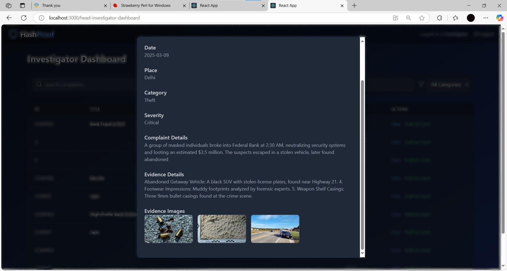

# HashProof

**HashProof** is a private, permissioned blockchain platform designed to enhance the transparency, security, and integrity of crime investigation processes. It ensures tamper-proof evidence handling and robust access control for law enforcement officials.

---

## Overview

Crime investigations often suffer from evidence tampering and unauthorized access. HashProof addresses these challenges by leveraging **MultiChain** (a permissioned blockchain) and **IPFS** (InterPlanetary File System) to build a secure and immutable system for managing criminal case data and digital evidence.

This project was developed by **Team: Chain of Justice** and was awarded an **internship offer by CID Karnataka** in recognition of its innovation and societal relevance.

---

## Key Features

- **Role-Based Access Control (RBAC):** Secure access for officials based on roles (e.g., Inspector, Forensic Analyst, Administrator).
- **Add & Manage Cases:** Officials can register new crime cases with structured metadata.
- **Evidence Upload & Management:** Store digital evidence (images, videos) securely on IPFS.
- **Blockchain Integration:** Case and metadata are stored immutably using MultiChain to ensure auditability and prevent tampering.
- **Tamper-Proof Architecture:** Combines cryptographic storage and permissioned access to protect investigation data integrity.

---

## Tech Stack

| Layer              | Technology Used                             |
|--------------------|---------------------------------------------|
| Frontend           | React, Tailwind CSS                         |
| Backend            | Flask                                       |
| Blockchain         | MultiChain (Private Blockchain)             |
| File Storage       | IPFS (InterPlanetary File System)           |

